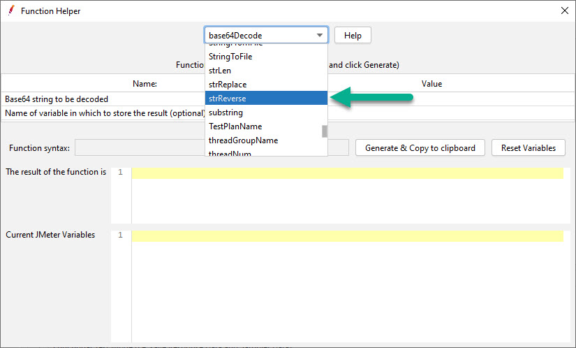

# ⚡ Apache JMeter Functions

## 🔁 Functions

* strReverse - to reverse the string

## 🤷 Usage

Download the latest jar from the [releases](https://github.com/QAInsights/jmeter-functions/releases). Place it in the `JMETER_HOME\lib\ext` folder. Restart JMeter.

Press `CTRL + Shift + F1` to launch `Function Helper Dialog`.

## 🙏 Contributions

All kinds of contributions are welcome. Please submit a PR.

